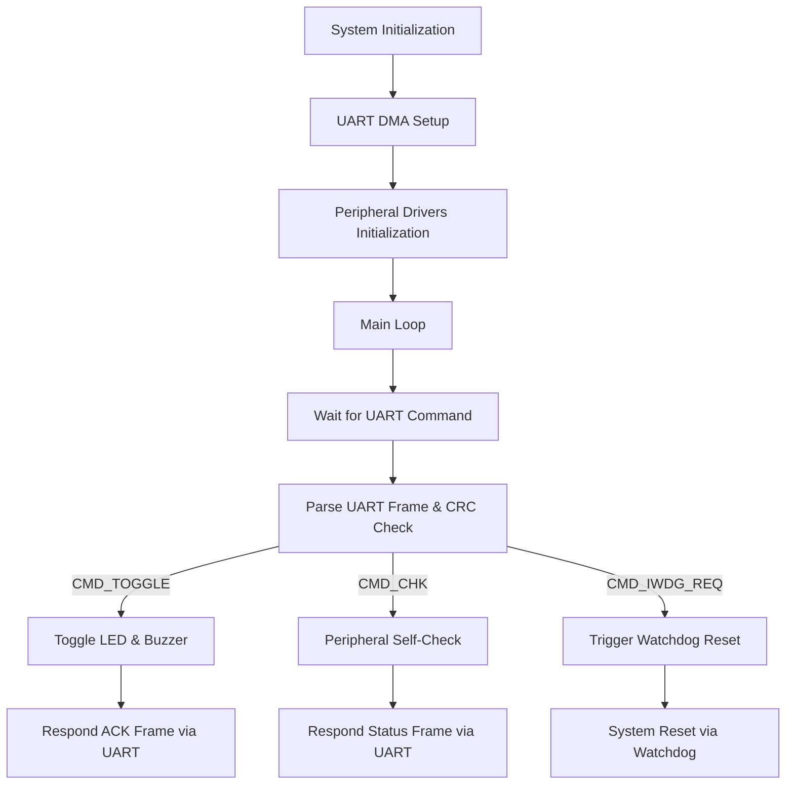

# STM32 Peripheral Firmware

## Overview
STM32-based firmware for managing peripheral devices including LEDs, buzzers, CDS light sensors, and temperature sensors using PCF8591T ADC/DAC via I²C. Features UART-based command processing, watchdog management, PWM control, ADC sampling, and hardware self-check mechanisms.

---

## Project Structure

```
.
├── main.c           / main.h            # Main application logic and initialization
├── LED.c            / LED.h             # LED control module
├── BUZZER.c         / BUZZER.h          # Buzzer control module
├── PCF8591T.c       / PCF8591T.h        # ADC/DAC and sensor management module
└── stm32f4xx_it.c                        # Interrupt handlers and UART DMA management
```
## Hardware Configuration

| Peripheral     | GPIO Pin   | Description                               |
|----------------|------------|-------------------------------------------|
| LED            | PA9        | Active-low LED                            |
| Buzzer         | PA8        | PWM Buzzer                                |
| CDS Sensor     | PCF8591 AIN0 | CDS Photoresistor (Light Sensor)        |
| Temp Sensor    | PCF8591 AIN1 | NTC Thermistor (Temperature Sensor)     |
| UART           | PA2 / PA3  | UART TX/RX Communication                  |

## Build & Development Environment

- **IDE**: Keil
- **Toolchain**: GNU Arm Embedded Toolchain V6.23
- **Libraries**: STM32Cube HAL, CMSIS
- **Debugger**: ST-Link V2/V3

### Build Steps:
1. Clone the repository.
2. Open Keil Project and import the project.
3. Build the project (`F7`).
4. Download or flash the firmware (`F8`).

## Firmware Features
### LED Control Module (`LED.c/.h`)
- **Modes**: ON, OFF, TOGGLE, Self-Check
- Periodically driven by timer interrupts.
- GPIO feedback-based self-check capability.

### Buzzer Control Module (`BUZZER.c/.h`)
- PWM-based frequency sweep.
- Self-check using ADC feedback.
- Configurable sweep frequencies and durations.

### ADC/DAC Sensor Module (`PCF8591T.c/.h`)
- I²C interface with PCF8591T chip.
- Manages CDS (light) and NTC (temperature) sensors.
- Provides averaged sampling and accurate sensor readings.


### Communication Protocol (UART)
The firmware employs UART communication with a structured frame protocol:<br>

 ex) [SOF][LEN][CMD][SEQ][TYPE][DATA][CRC16]
- `SOF`: `0x7E`
- `LEN`: Payload length (from CMD to CRC)
- `CMD`: Command identifier
- `SEQ`: Sequence number
- `TYPE`: `0x00` (Request), `0x01` (Response)
- `CRC16`: Modbus CRC16 checksum

### Command Codes

| Command          | Code  | Description                               |
|------------------|-------|-------------------------------------------|
| `CMD_TOGGLE`     | 0x10  | Toggles LED and initiates buzzer sweep    |
| `CMD_CHK`        | 0x11  | Initiates peripheral self-check           |
| `CMD_IWDG_REQ`   | 0x12  | Requests watchdog reset                   |

---
## Firmware Operation Flow


---

## Watchdog Management (IWDG)

- Periodically refreshed under normal conditions.
- UART command (`CMD_IWDG_REQ`) intentionally triggers watchdog reset for system validation.

---

## Usage Examples


- python
```
import serial
import struct
import time

SOF       = 0x7E
CMD_TOGGLE= 0x10
CMD_CHK   = 0x11
TYPE_REQ  = 0x00
TYPE_RSP  = 0x01

# CRC-16-IBM
def calc_crc16(buf: bytes) -> int:
    crc = 0xFFFF
    for b in buf:
        crc ^= b
        for _ in range(8):
            if crc & 1:
                crc = (crc >> 1) ^ 0xA001
            else:
                crc >>= 1
    return crc & 0xFFFF

def build_frame(cmd: int, seq: int, type_: int, data: bytes=b'') -> bytes:
    length = 1+1+1+len(data)+2  # CMD+SEQ+TYPE+DATA+CRC
    frame = bytearray([SOF, length, cmd, seq, type_]) + data
    crc = calc_crc16(frame[2:])
    frame += struct.pack('<H', crc)
    return bytes(frame)

def parse_frame(frame: bytes):
    # 기본 유효성 검사
    if frame[0] != SOF:
        raise ValueError('Bad SOF')
    length = frame[1]
    if len(frame) != length+2:
        raise ValueError('Bad LEN')
    cmd, seq, type_ = frame[2], frame[3], frame[4]
    data = frame[5:-2]
    recv_crc = struct.unpack('<H', frame[-2:])[0]
    if calc_crc16(frame[2:-2]) != recv_crc:
        raise ValueError('CRC error')
    return cmd, seq, type_, data

def read_frame(ser: serial.Serial, timeout=1.0):
    t0 = time.time()
    buf = bytearray()
    while time.time() - t0 < timeout:
        b = ser.read(1)
        if not b: continue
        buf += b
        # 최소 길이 도달했으면 전체 읽기 시도
        if len(buf) >= 2:
            expected = buf[1] + 2
            if len(buf) >= expected:
                return parse_frame(bytes(buf[:expected]))
    raise TimeoutError('Frame timeout')

def main():
    ser = serial.Serial('COM3', 115200, timeout=0.1)
    seq = 0

    # 1) TOGGLE
    frame = build_frame(CMD_TOGGLE, seq, TYPE_REQ)
    ser.write(frame)
    print(f"Sent TOGGLE (seq={seq})")
    seq = (seq + 1) & 0xFF
    time.sleep(4)

    # 2) CHK
    frame = build_frame(CMD_CHK, seq, TYPE_REQ)
    ser.write(frame)
    print(f"Sent CHK (seq={seq})")
    # 응답 대기
    cmd, rseq, type_, data = read_frame(ser, timeout=2)
    if cmd == CMD_CHK and type_ == TYPE_RSP and rseq == seq:
        led, buzz = data[0], data[1]
        cds = data[2] | (data[3] << 8)
        temp = struct.unpack('<f', data[4:8])[0]
        print(f"Response: LED={led}, BUZZ={buzz}, CDS={cds}, TEMP={temp:.1f}")
    else:
        print("Unexpected frame:", cmd, rseq, type_, data)
    ser.close()

if __name__ == '__main__':
    main()

```


- C ++
ex) g++ ex.cpp 

```
#include <iostream>
#include <vector>
#include <cstdint>
#include <cstring>
#include <stdexcept>
#include <chrono>
#include <thread>
#include <fcntl.h>
#include <termios.h>
#include <unistd.h>

constexpr uint8_t SOF        = 0x7E;
constexpr uint8_t CMD_TOGGLE = 0x10;
constexpr uint8_t CMD_CHK    = 0x11;
constexpr uint8_t TYPE_REQ   = 0x00;
constexpr uint8_t TYPE_RSP   = 0x01;

uint16_t calc_crc16(const std::vector<uint8_t>& buf) {
    uint16_t crc = 0xFFFF;
    for (uint8_t b : buf) {
        crc ^= b;
        for (int i = 0; i < 8; ++i) {
            if (crc & 1)
                crc = (crc >> 1) ^ 0xA001;
            else
                crc >>= 1;
        }
    }
    return crc;
}

std::vector<uint8_t> build_frame(uint8_t cmd, uint8_t seq, uint8_t type, const std::vector<uint8_t>& data = {}) {
    uint8_t length = 1 + 1 + 1 + data.size() + 2;
    std::vector<uint8_t> frame = { SOF, length, cmd, seq, type };
    frame.insert(frame.end(), data.begin(), data.end());

    std::vector<uint8_t> crc_input(frame.begin() + 2, frame.end());
    uint16_t crc = calc_crc16(crc_input);
    frame.push_back(static_cast<uint8_t>(crc & 0xFF));
    frame.push_back(static_cast<uint8_t>((crc >> 8) & 0xFF));
    return frame;
}

struct ParsedFrame {
    uint8_t cmd;
    uint8_t seq;
    uint8_t type;
    std::vector<uint8_t> data;
};

ParsedFrame parse_frame(const std::vector<uint8_t>& frame) {
    if (frame.size() < 7 || frame[0] != SOF)
        throw std::runtime_error("Bad frame: SOF or too short");

    uint8_t length = frame[1];
    if (frame.size() != length + 2)
        throw std::runtime_error("Bad LEN");

    std::vector<uint8_t> crc_input(frame.begin() + 2, frame.end() - 2);
    uint16_t expected_crc = calc_crc16(crc_input);
    uint16_t recv_crc = frame[frame.size() - 2] | (frame[frame.size() - 1] << 8);

    if (recv_crc != expected_crc)
        throw std::runtime_error("CRC error");

    return ParsedFrame {
        frame[2], // cmd
        frame[3], // seq
        frame[4], // type
        std::vector<uint8_t>(frame.begin() + 5, frame.end() - 2) // data
    };
}

int open_serial(const std::string& port, int baudrate = B115200) {
    int fd = open(port.c_str(), O_RDWR | O_NOCTTY);
    if (fd < 0)
        throw std::runtime_error("Failed to open serial port");

    termios tty{};
    tcgetattr(fd, &tty);
    cfsetospeed(&tty, baudrate);
    cfsetispeed(&tty, baudrate);
    tty.c_cflag = CS8 | CLOCAL | CREAD;
    tty.c_iflag = 0;
    tty.c_oflag = 0;
    tty.c_lflag = 0;
    tty.c_cc[VMIN] = 0;
    tty.c_cc[VTIME] = 1;

    tcsetattr(fd, TCSANOW, &tty);
    return fd;
}

int read_byte(int fd, uint8_t& out, int timeout_ms = 100) {
    fd_set set;
    FD_ZERO(&set);
    FD_SET(fd, &set);
    timeval timeout{};
    timeout.tv_sec = timeout_ms / 1000;
    timeout.tv_usec = (timeout_ms % 1000) * 1000;

    if (select(fd + 1, &set, nullptr, nullptr, &timeout) > 0) {
        return read(fd, &out, 1);
    }
    return 0;
}

ParsedFrame read_frame(int fd, double timeout_sec = 1.0) {
    using clock = std::chrono::steady_clock;
    auto t0 = clock::now();
    std::vector<uint8_t> buf;
    uint8_t b;

    while (std::chrono::duration<double>(clock::now() - t0).count() < timeout_sec) {
        if (read_byte(fd, b, 100) == 1) {
            buf.push_back(b);
            if (buf.size() >= 2) {
                size_t expected = buf[1] + 2;
                if (buf.size() >= expected) {
                    return parse_frame(buf);
                }
            }
        }
    }
    throw std::runtime_error("Timeout reading frame");
}

int main() {
    try {
        int fd = open_serial("/dev/ttyACM0");
        uint8_t seq = 0;

        // 1. Send TOGGLE
        auto frame1 = build_frame(CMD_TOGGLE, seq, TYPE_REQ);
        write(fd, frame1.data(), frame1.size());
        std::cout << "Sent TOGGLE (seq=" << (int)seq << ")\n";
        seq = (seq + 1) & 0xFF;
        std::this_thread::sleep_for(std::chrono::seconds(3));

        // 2. Send CHK
        auto frame2 = build_frame(CMD_CHK, seq, TYPE_REQ);
        write(fd, frame2.data(), frame2.size());
        std::cout << "Sent CHK (seq=" << (int)seq << ")\n";

        auto response = read_frame(fd, 2.0);
        if (response.cmd == CMD_CHK && response.type == TYPE_RSP && response.seq == seq) {
            uint8_t led = response.data[0];
            uint8_t buzz = response.data[1];
            uint16_t cds = response.data[2] | (response.data[3] << 8);
            float temp;
            std::memcpy(&temp, &response.data[4], sizeof(float));

            std::cout << "Response: LED=" << (int)led
                      << ", BUZZ=" << (int)buzz
                      << ", CDS=" << cds
                      << ", TEMP=" << temp << "°C\n";
        } else {
            std::cerr << "Unexpected response\n";
        }

        close(fd);
    } catch (const std::exception& ex) {
        std::cerr << "Exception: " << ex.what() << "\n";
        return 1;
    }
    return 0;
}

```


## Roadmap

- [ ] Bluetooth Low Energy (BLE) Integration
- [ ] Power Management Optimization (Low-power modes)
- [ ] EEPROM Support for Persistent Configurations
- [ ] Web-based Configuration Interface
- [ ] Additional Sensor Integration (Humidity, Pressure)
- [ ] OTA (Over-The-Air) Firmware Update


## License

This software is distributed under the terms provided by STMicroelectronics. Please see [MIT License](https://opensource.org/licenses/MIT). for full details.